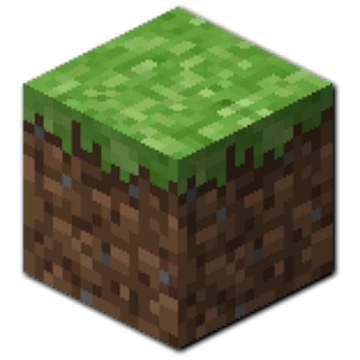

# Drav Notes 

A Minecraft Bungee Plugin that adds note taking to Minecraft.

---

## Features

### Notes

Notes allows staff to log any information on users that may be useful for other staff at a later date. 
If that is for hacking, misbehaving, or any other thing, a note can be made and checked at a later date.

### X-Ray 

X-Ray allows staff to add a user to a list of possible X-ray hacking, which can be referenced later by
another staff member to confirm the suspicion. 
